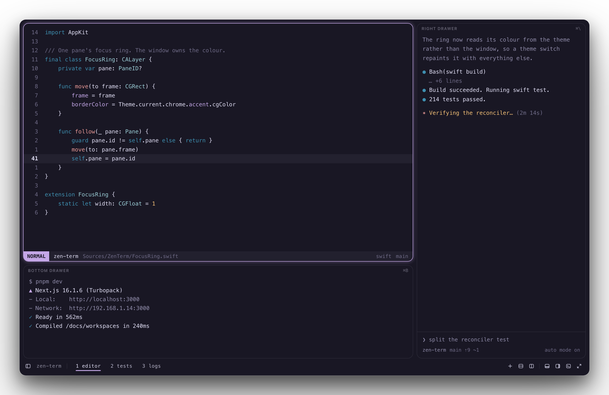
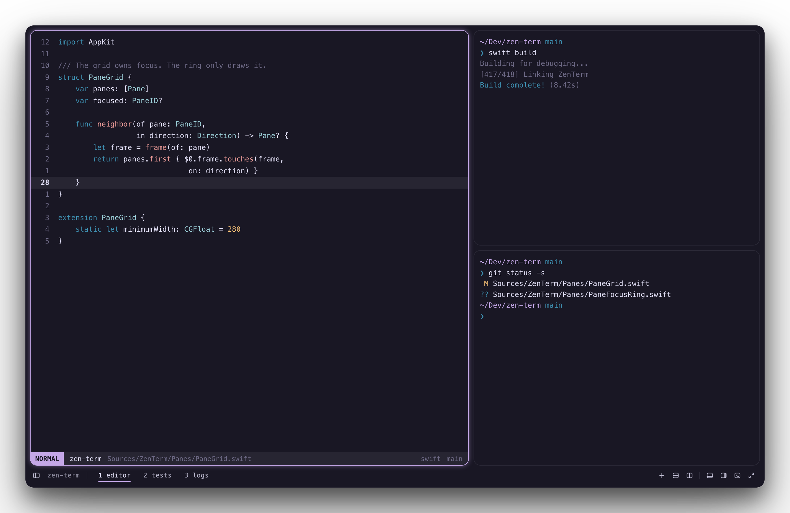
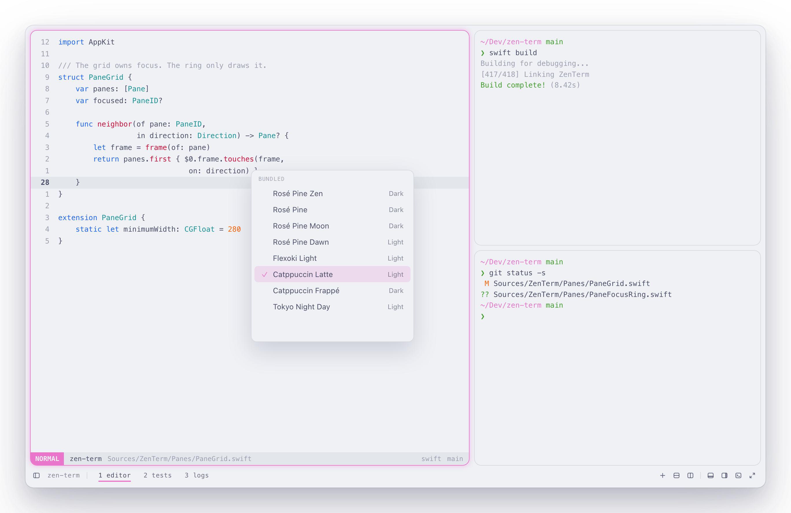
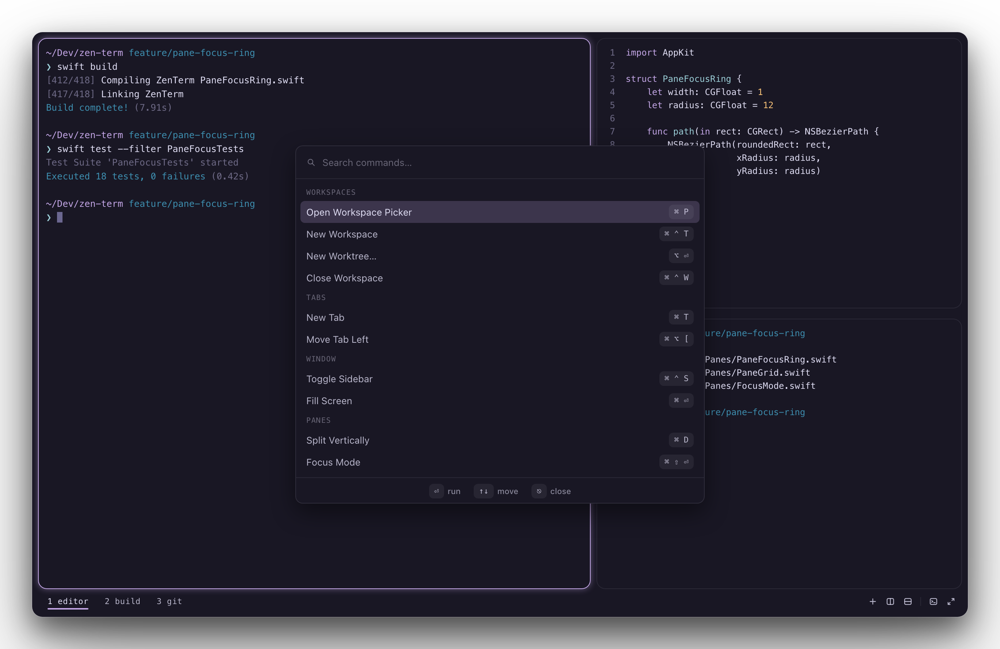
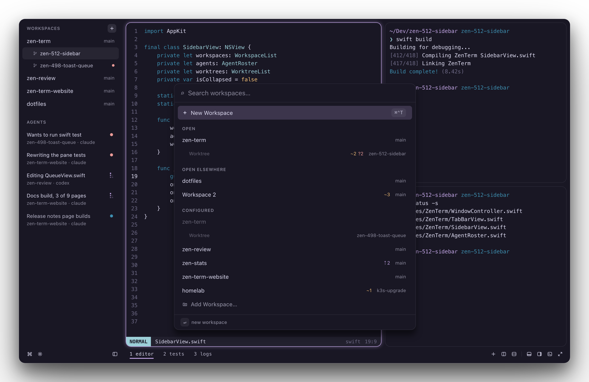
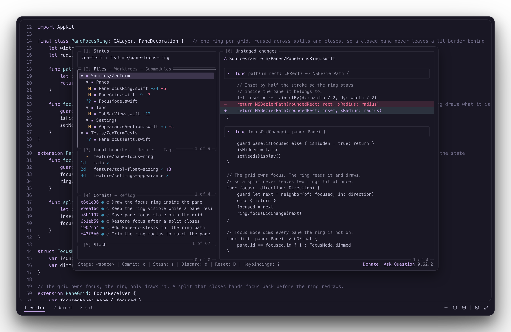
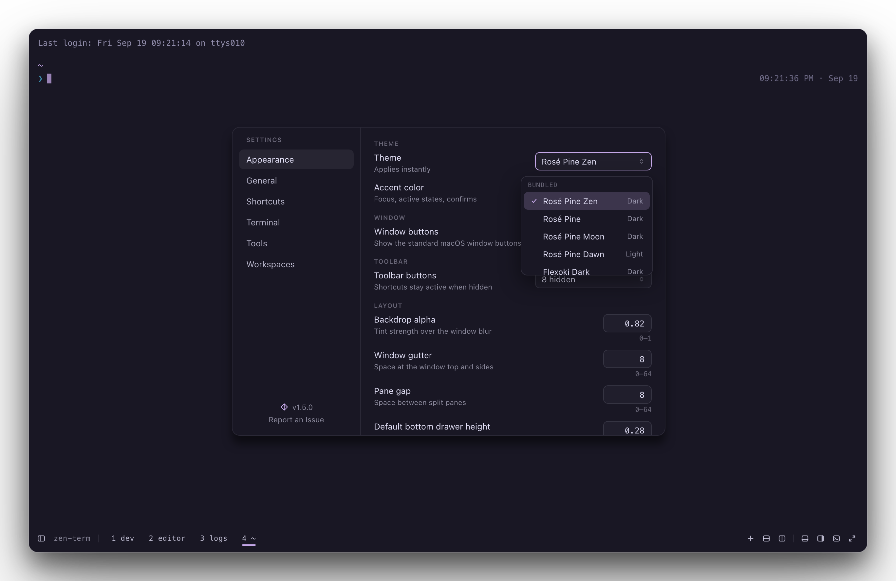

# ZenTerm

ZenTerm is a modern macOS terminal built on a libghostty core. Native panes and
windows, hideable drawers and floats, tools bound to the keys you pick, and
workspaces you define.

The terminal emulation is Ghostty's own, from
[libghostty](https://ghostty.org), built from a pinned `vendor/ghostty`
submodule. The layout, input routing, scroll mode, theming, and chrome are
ZenTerm's. All of it exists so you can reach your toolchain without stopping to
find somewhere to run it.

Release notes, documentation, and guides live at
[zenterm.io](https://zenterm.io).



One tab, three shells. ⌘B opens the drawer along the bottom, ⌘\ opens the one
down the right side, and each runs its own shell with its chord printed in the
corner. Hiding a drawer does not stop its process. The dev server here keeps
running while the drawer is hidden. The numbered tabs along the bottom are ⌘1
through ⌘9.

## Install

Download `ZenTerm-<version>-arm64.dmg` from the
[releases page](https://github.com/praxis-labs-io/zen-term/releases), open it, and drag
**ZenTerm** onto **Applications**. The app is signed and notarized, so macOS opens
it without an "unidentified developer" warning.

Apple Silicon, macOS 14 or later. There is no Intel build.

ZenTerm expects [JetBrains Mono Nerd Font](https://www.nerdfonts.com/font-downloads),
which macOS does not ship:

```sh
brew install --cask font-jetbrains-mono-nerd-font
```

ZenTerm updates itself from then on. [`docs/onboarding.md`](docs/onboarding.md) walks
through the first hour.

## What it does

- **Panes that tile.** Split right or down, and move between panes by direction
  rather than by order.
- **Two drawers per tab.** One along the bottom, one down the right side, each
  running its own shell and resizable from the keyboard.
- **Tool floats.** Any command you name in the config becomes a card over your
  work on a chord you pick: lazygit, lazydocker, btop, a dev server. A float can
  stay warm between opens, or shut down when you dismiss it.
- **Workspaces.** A folder plus a layout, so a project opens the way you left it.
- **A command palette over every action.** It lists actions by group with each
  one's current shortcut, filters as you type, and runs the selection on Enter.
  Rebind something and the palette shows the new chord.
- **Scroll mode and Find, in vim keys.** Move through the scrollback with
  `hjkl`, `w`/`b`/`e`, and `{`/`}`. `v` and `V` select, `y` copies.
- **One motion across Neovim splits and ZenTerm panes.** Bind `ctrl+hjkl` to the
  `nav_*` actions and install
  [zen-navigator.nvim](https://github.com/praxis-labs-io/zen-navigator.nvim):
  nvim walks its own splits and hands off to ZenTerm at the edge.
- **17 themes**, and a bring-your-own theme file. A theme colors the whole app,
  not the terminal text alone.
- **A notification when an agent needs you.** With ZenTerm in the background and
  an agent stopped for input, macOS posts a banner and the tab's number takes the
  theme's attention color until you visit it.
- **No telemetry, no analytics, no account.** The only request ZenTerm makes on its
  own is an update check, which asks GitHub for a version number and sends nothing
  about you.

## Shortcuts

Defaults. Every one is rebindable in the config, and the command palette lists
your current shortcut for each action.

| Action | Default |
| --- | --- |
| Split right | ⌘D |
| Split down | ⌘⇧D |
| Move focus by direction | ⌘⌥ + arrow |
| Toggle bottom drawer | ⌘B |
| Toggle right drawer | ⌘\ |
| Select tab 1 through 9 | ⌘1 – ⌘9 |
| Workspaces | ⌘P |
| Command palette | ⌘⇧P |
| Scroll mode | ⌘⇧S |
| Settings | ⌘, |

Tool floats have no defaults. Each one takes the chord you give it in the
config.

## A look around



Three panes in one tab. The focused pane carries the halo, so you can see where
the next keystroke lands without hunting for a cursor. The gap between panes and
the padding around them are both yours to set.



The same window on Catppuccin Latte. A theme colors the terminal, the tab bar,
the toolbar, the focus halo, and Settings itself, so a light theme stays light
through the whole app. 17 ship, each marked Dark or Light in the picker, and a
`theme = ` line pointed at any Ghostty theme file works the same way.



The palette filters as you type and runs the selection on Enter. Each row carries
the shortcut that runs it, read from your config, so a rebind shows up here right
away.



The workspaces you named, each one a folder plus a layout. ZenTerm does not scan
directories to fill this list, so it holds only what you put there.



A float is one `float =` line in the config: a title, a command, and the chord
that toggles it. It opens over the work instead of taking a pane, so the panes
and drawers underneath keep their places. `persist:dir` keeps one warm per
repository. The first open is cold and every reopen is instant.

## Configure it

One file, `~/.config/zen-term/config`, in Ghostty's config syntax. Settings
writes the same file, so the two never disagree.
[`docs/config/config`](docs/config/config) is the annotated reference: every key,
its default, and what a bad line does.



Picking a theme here writes the `theme =` line you would have typed. The row says
it applies instantly, and it recolors the terminal, the tabs, and the chrome
while the pane is still open. The pane and the file hold the same keys, so
editing either one gives you the same result.

## Build from source

```sh
git clone https://github.com/praxis-labs-io/zen-term.git && cd zen-term
bin/build-ghosttykit   # inits the vendor/ghostty submodule, fetches Zig,
                       # builds GhosttyKit.xcframework + runtime resources
brew install swiftlint # bin/check needs it
bin/run
```

`bin/build-ghosttykit` takes a few minutes and reruns only when the ghostty pin
or the script changes. You need Xcode 26 or later: the package manifest declares
`swift-tools-version: 6.2`, and the Metal compiler is not in the Command Line
Tools alone.

## Documentation

- [`docs/onboarding.md`](docs/onboarding.md) walks through the app for someone
  opening it for the first time.
- [`docs/config/config`](docs/config/config) and
  [`docs/config/workspaces`](docs/config/workspaces) are the reference files.
- [`docs/architecture.md`](docs/architecture.md) is how the app fits together.
- [`docs/swift-conventions.md`](docs/swift-conventions.md) collects the AppKit
  traps that cost us a release each.
- [`docs/releasing.md`](docs/releasing.md) is how a build gets released.
- [`docs/release-notes/`](docs/release-notes) is every version, curated.

## Contributing

Read [`docs/CONTRIBUTING.md`](docs/CONTRIBUTING.md). The short version: `bin/check`
is the gate, one branch is one pull request, and `CLAUDE.md` holds the rules an
agent working in this repo follows.

## Security

Report a vulnerability privately. [`SECURITY.md`](SECURITY.md) says how.

## License

MIT. See [LICENSE](LICENSE). Third-party notices ship inside the app and live in
[`Sources/ZenTerm/Resources/THIRD-PARTY-NOTICES.md`](Sources/ZenTerm/Resources/THIRD-PARTY-NOTICES.md).
